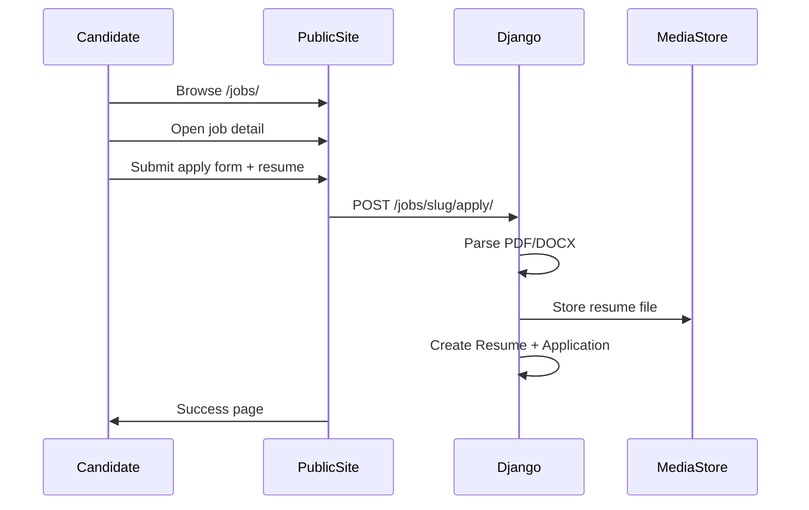
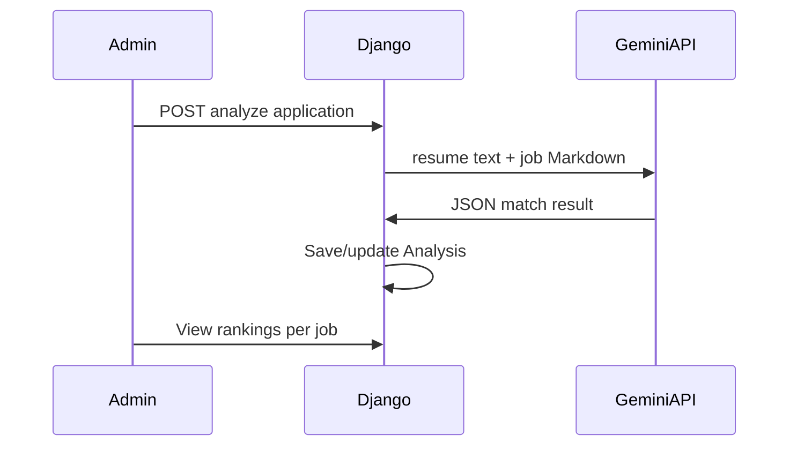

# Data Flow

## Public application flow

## Admin AI analysis flow

## Routes

| Surface | Path | Auth |
|---------|------|------|
| Public jobs | `/jobs/` | None |
| Apply | `/jobs/<slug>/apply/` | None |
| Admin | `/admin/` | Login + admin role |
| Login | `/accounts/login/` | None |
