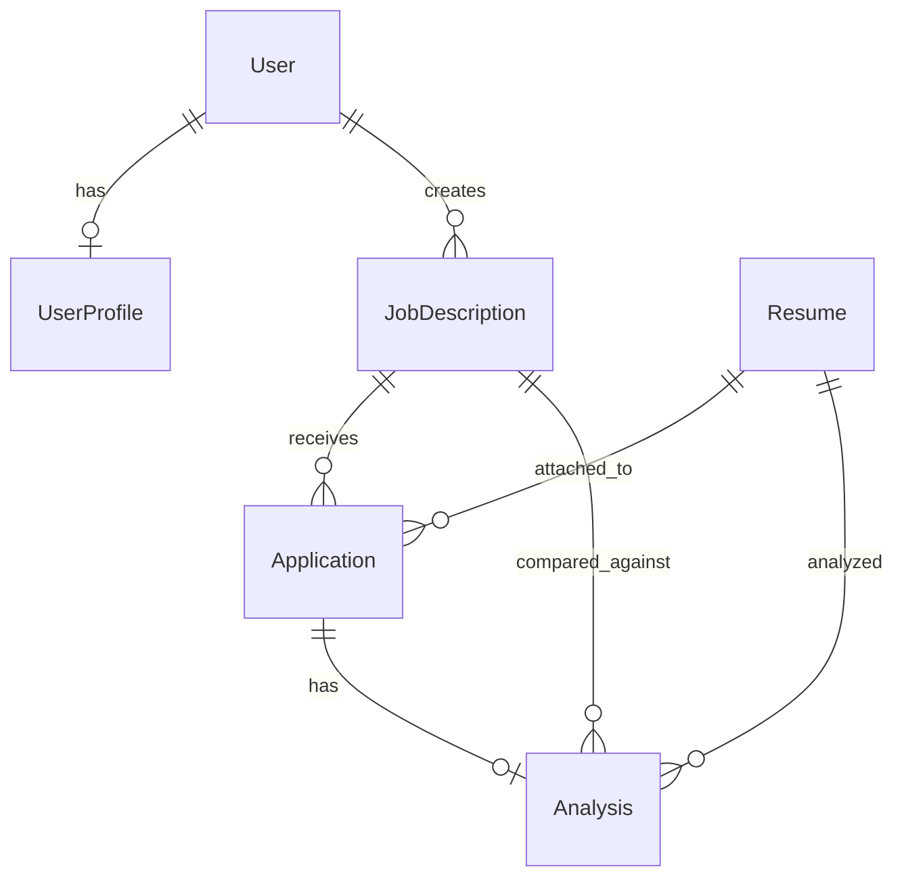

# Data Model

## Entity relationship

## Models

### JobDescription (`features/jobs`)

| Field | Type | Notes |
|-------|------|-------|
| title | CharField | Job title |
| slug | SlugField | Unique, auto-generated from title |
| description | TextField | Markdown (README-style) |
| is_published | BooleanField | Visible on public `/jobs/` board |
| required_skills | JSONField | Optional extracted skills |
| created_by | FK → User | Admin who created the job |

### Application (`features/applications`)

| Field | Type | Notes |
|-------|------|-------|
| job | FK → JobDescription | Role applied for |
| resume | FK → Resume | Uploaded file + parsed text |
| full_name, email, phone | — | Applicant form |
| cover_letter | TextField | Optional |
| status | CharField | `submitted` / `reviewed` |

### Resume (`features/resumes`)

| Field | Type | Notes |
|-------|------|-------|
| file | FileField | PDF or DOCX |
| raw_text | TextField | Extracted text |
| candidate_name | CharField | From application |
| email | EmailField | Applicant email |
| uploaded_by | FK → User | Nullable (public applicants) |

### Analysis (`features/analysis`)

| Field | Type | Notes |
|-------|------|-------|
| application | OneToOne → Application | Primary admin link |
| resume, job | FK | Denormalized for rankings |
| ats_score | FloatField | 0–100 match score |
| recommendation | CharField | e.g. Strong fit, Good fit |
| matched_skills, missing_skills | JSONField | Skill comparison |
| suggestions | JSONField | Improvement tips |
| ai_summary | TextField | Narrative fit summary |
| skill_match_pct, ai_confidence | FloatField | Model metrics |
