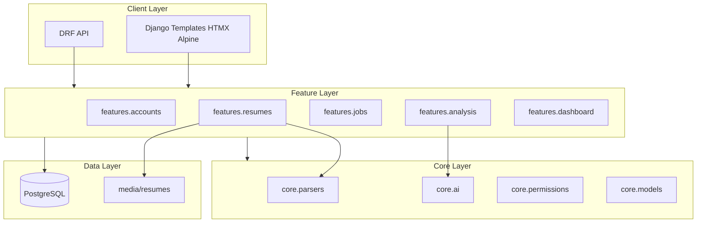

# Architecture Overview

HireLens is an AI-powered resume analysis and recruitment intelligence platform built with Django, Django REST Framework, and the Gemini API.

## System Layers

## Design Principles

1. **Feature isolation** — Each domain lives in `features/<name>/` with its own models, views, services, and templates.
2. **Shared core** — Cross-cutting concerns (AI client, parsers, permissions, base models) live in `core/`.
3. **Downstream dependencies only** — `dashboard` may read from `analysis`, but `resumes` must not import from `dashboard`.
4. **Thin views, fat services** — HTTP handlers delegate to `services/` for business logic.
5. **API parity** — DRF endpoints mirror web functionality where applicable.

## Technology Stack

| Layer | Technology |
|-------|------------|
| Backend | Django 5.x, Django REST Framework |
| Frontend | Django Templates, TailwindCSS, HTMX, Alpine.js |
| AI | Google Gemini API |
| Database | PostgreSQL (SQLite fallback for local dev) |
| File parsing | pdfplumber, python-docx |

## User Roles

| Role | Capabilities |
|------|--------------|
| **Admin** | Full access: users, analytics, API monitoring, exports |
| **Recruiter** | Upload resumes, create jobs, run analysis, view rankings |

Roles are stored on `UserProfile` (OneToOne with Django `User`).

## Related Documents

- [Folder Structure](folder-structure.md)
- [Data Model](data-model.md)
- [Data Flow](data-flow.md)
- [API Design](api-design.md)
- [Security](security.md)
